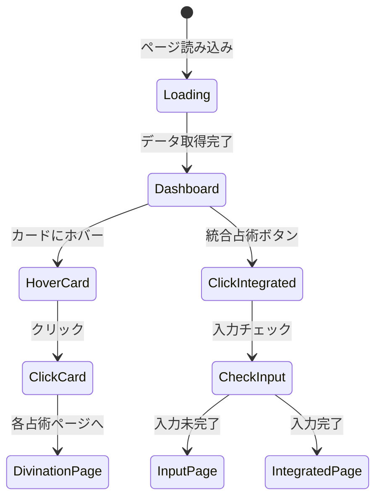

# ダッシュボード画面要素マップ (/)

## 画面概要
- **目的**: ユーザーの占術ダッシュボード
- **パス**: `/`
- **コンポーネント**: `src/app/dashboard-client.tsx`

## レイアウト構造

```
+----------------------------------+
|     dashboard-header-main        |
+----------------------------------+
| dashboard-card-cosmic    | dash- |
| (lg:col-span-2           | board-|
|  lg:row-span-2)          | card- |
|                          | env   |
|                          +-------+
|                          | dash- |
|                          | board-|
|                          | card- |
|                          | guide |
+----------+-------+-------+-------+
|     dashboard-section-divinations |
|  (10 divination cards in grid)   |
+----------------------------------+
|    dashboard-section-integration  |
+----------------------------------+
```

## 要素マップ

```typescript
interface DashboardElements {
  // ヘッダーエリア
  'dashboard-header-main': {
    type: 'header';
    position: 'fixed-top';
    style: 'bg-slate-900/50 backdrop-blur-lg border-b border-white/10';
    children: ['dashboard-logo', 'dashboard-nav-user'];
  };
  
  'dashboard-logo': {
    type: 'h1';
    text: 'COSMIC ORACLE';
    style: 'text-2xl font-light text-white';
  };
  
  'dashboard-nav-user': {
    type: 'nav';
    position: 'right';
    children: ['dashboard-user-avatar', 'dashboard-user-menu'];
  };
  
  // メインコンテンツ
  'dashboard-card-cosmic': {
    type: 'section';
    title: '今日の宇宙図';
    gridArea: 'lg:col-span-2 lg:row-span-2';
    component: 'CosmicOverview';
    interactive: true;
    animations: [
      'planet-rotation',
      'star-twinkle',
      'cosmic-cloud-float'
    ];
  };
  
  'dashboard-card-environment': {
    type: 'section';
    title: '環境データ';
    gridArea: 'lg:col-span-1';
    component: 'EnvironmentalData';
    dataSource: 'realtime';
    refreshInterval: 300000; // 5分
  };
  
  'dashboard-card-guidance': {
    type: 'section';
    title: '今日の指針';
    gridArea: 'lg:col-span-1';
    component: 'DailyGuidance';
    updateFrequency: 'daily';
  };
  
  // 占術セクション
  'dashboard-section-divinations': {
    type: 'section';
    title: '占術一覧';
    layout: 'grid';
    gridCols: {
      mobile: 1,
      tablet: 2,
      desktop: 3
    };
    children: [
      'dashboard-card-numerology',
      'dashboard-card-tarot',
      'dashboard-card-astrology',
      'dashboard-card-iching',
      'dashboard-card-runes',
      'dashboard-card-vedic',
      'dashboard-card-nine-star',
      'dashboard-card-feng-shui',
      'dashboard-card-celtic',
      'dashboard-card-kabbalah'
    ];
  };
  
  // 占術カード（例: 数秘術）
  'dashboard-card-numerology': {
    type: 'card';
    title: '数秘術';
    subtitle: 'Numerology';
    icon: '🔢';
    destination: '/divination/numerology';
    style: 'glass-card hover:scale-105';
    hoverAnimation: 'float';
    preview: {
      lifePathNumber: 7,
      todayNumber: 3
    };
  };
  
  // 統合分析パネル
  'dashboard-section-integration': {
    type: 'section';
    title: '統合分析';
    component: 'IntegrationPanel';
    features: [
      'ai-synthesis',
      'pattern-recognition',
      'trend-analysis'
    ];
  };
  
  'dashboard-button-integrated': {
    type: 'button';
    text: '🌌 統合占術を開始する';
    destination: '/divination/integrated';
    style: 'w-full py-4 bg-gradient-to-r from-purple-600 to-blue-600';
    requiresInput: true;
  };
}
```

## 占術カード一覧

| ID | 占術名 | アイコン | パス |
|---|---|---|---|
| dashboard-card-numerology | 数秘術 | 🔢 | /divination/numerology |
| dashboard-card-tarot | タロット | 🃏 | /divination/tarot |
| dashboard-card-astrology | 西洋占星術 | ♈ | /divination/astrology |
| dashboard-card-iching | 易経 | ☯ | /divination/iching |
| dashboard-card-runes | ルーン | ᚠ | /divination/runes |
| dashboard-card-vedic | インド占星術 | 🕉 | /divination/vedic |
| dashboard-card-nine-star | 九星気学 | ☆ | /divination/nine-star-ki |
| dashboard-card-feng-shui | 風水 | 🧿 | /divination/feng-shui |
| dashboard-card-celtic | ケルト占術 | 🍀 | /divination/celtic |
| dashboard-card-kabbalah | カバラ数秘術 | 🔯 | /divination/kabbalah |

## アニメーション定義

### 宇宙図アニメーション
```css
@keyframes planet-rotation {
  from { transform: rotate(0deg); }
  to { transform: rotate(360deg); }
}

@keyframes star-twinkle {
  0%, 100% { opacity: 0.3; }
  50% { opacity: 1; }
}

@keyframes cosmic-cloud-float {
  0%, 100% { transform: translateY(0); }
  50% { transform: translateY(-20px); }
}
```

### カードホバーアニメーション
- **浮遊効果**: 20-40秒サイクル
- **スケール**: hover:scale-105
- **グロウ効果**: ホバー時にボーダーが光る

## インタラクションフロー



## リアルタイムデータ更新

### 環境データ
- **更新間隔**: 5分
- **データソース**: 
  - 気象庁API
  - 月相API
  - 天体位置API

### アニメーション同期
- 宇宙図: 現在時刻に同期
- 惑星位置: リアルタイム更新
- 月相: 日次更新

## レスポンシブ対応

### モバイル (< 768px)
- グリッド: 1列
- ナビゲーション: ハンバーガーメニュー
- カード: 縦積み

### タブレット (768px - 1023px)
- グリッド: 2列
- 宇宙図: 全幅
- カード: 2列グリッド

### デスクトップ (≥ 1024px)
- グリッド: 3列
- 宇宙図: 2×2グリッド
- カード: 3列グリッド

## アクセシビリティ

### ARIA属性
- 各カード: `role="article"`, `aria-label="[占術名]カード"`
- リアルタイムデータ: `aria-live="polite"`
- ナビゲーション: `role="navigation"`

### キーボード操作
- Tab: カード間の移動
- Enter/Space: カード選択
- Escape: モーダルを閉じる

## パフォーマンス最適化

1. **遅延読み込み**
   - 占術カード: Intersection Observer
   - アニメーション: 表示領域のみ実行

2. **キャッシュ戦略**
   - 環境データ: 5分キャッシュ
   - 占術結果: sessionStorage

3. **コード分割**
   - dynamic importで占術コンポーネントを遅延読み込み