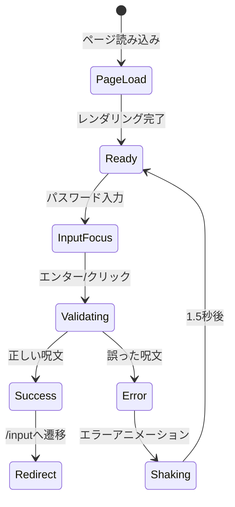

# エントリー画面要素マップ (/entry)

## 画面概要
- **目的**: アプリケーションへのアクセス制限
- **パス**: `/entry`
- **コンポーネント**: `src/app/entry/page.tsx`

## 要素マップ

```typescript
interface EntryPageElements {
  // ヘッダーエリア
  'entry-header-title': {
    type: 'h1';
    text: 'COSMIC ORACLE';
    position: { x: 'center', y: 'top-20%' };
    style: 'text-5xl font-light text-white tracking-wider';
  };
  
  'entry-text-subtitle': {
    type: 'p';
    text: '宇宙の扉を開く呪文を唱えてください';
    position: { x: 'center', y: 'top-30%' };
    style: 'text-lg text-purple-300 opacity-80';
  };
  
  // フォームエリア
  'entry-form-container': {
    type: 'form';
    position: { x: 'center', y: 'center' };
    style: 'bg-white/5 backdrop-blur-xl rounded-3xl p-8';
    children: ['entry-label-password', 'entry-input-password', 'entry-button-enter', 'entry-text-error'];
  };
  
  'entry-label-password': {
    type: 'label';
    text: '呪文 / Incantation';
    for: 'entry-input-password';
    style: 'text-sm font-light text-purple-200';
  };
  
  'entry-input-password': {
    type: 'input';
    inputType: 'password';
    placeholder: '宇宙への鍵を入力...';
    validation: {
      required: true;
      pattern: /^[a-zA-Z0-9]+$/;
    };
    style: 'w-full px-4 py-3 bg-white/10 border border-white/20 rounded-xl';
  };
  
  'entry-button-enter': {
    type: 'button';
    text: '扉を開く';
    action: 'validatePassword';
    destination: '/input';
    style: 'w-full py-3 bg-gradient-to-r from-purple-600 to-blue-600';
    hoverStyle: 'hover:from-purple-700 hover:to-blue-700 transform hover:scale-105';
  };
  
  'entry-text-error': {
    type: 'p';
    text: '呪文が違います...';
    visibility: 'conditional';
    condition: 'invalidPassword';
    style: 'text-red-400 text-sm text-center animate-pulse';
  };
  
  // フッターエリア
  'entry-footer-note': {
    type: 'p';
    text: '特別な方々のみへのプレビュー版です';
    position: { x: 'center', y: 'bottom-10%' };
    style: 'text-xs text-white/40';
  };
}
```

## インタラクションフロー



## アニメーション要素

### 背景アニメーション
- **CosmicBackground**: 宇宙的な背景アニメーション
- **星の流れ**: 45秒サイクル
- **宇宙雲**: グラデーションアニメーション

### エラーアニメーション
```css
@keyframes shake {
  0%, 100% { transform: translateX(0); }
  10%, 30%, 50%, 70%, 90% { transform: translateX(-10px); }
  20%, 40%, 60%, 80% { transform: translateX(10px); }
}
```

## アクセシビリティ

### ARIA属性
- `entry-input-password`: `aria-label="アクセス用呪文入力"`
- `entry-button-enter`: `aria-label="呪文を確認してアプリに入る"`
- `entry-text-error`: `aria-live="polite"` (エラー表示時)

### キーボード操作
- Tab: 入力フィールド → ボタン
- Enter: フォーム送信
- Escape: 入力クリア（オプション）

## レスポンシブ対応

### モバイル (< 768px)
- フォーム幅: 90%
- フォントサイズ調整
- パディング縮小

### タブレット (768px - 1023px)
- フォーム幅: max-w-md
- 標準レイアウト

### デスクトップ (≥ 1024px)
- フォーム幅: max-w-md
- 大きいフォントサイズ

## セキュリティ考慮

1. **パスワード保護**
   - 入力タイプ: password
   - クライアントサイド検証のみ
   - 環境変数で管理

2. **セッション管理**
   - sessionStorageで認証状態保持
   - ブラウザ終了時に自動クリア

3. **ブルートフォース対策**
   - エラー時に入力クリア
   - 連続試行制限（実装予定）