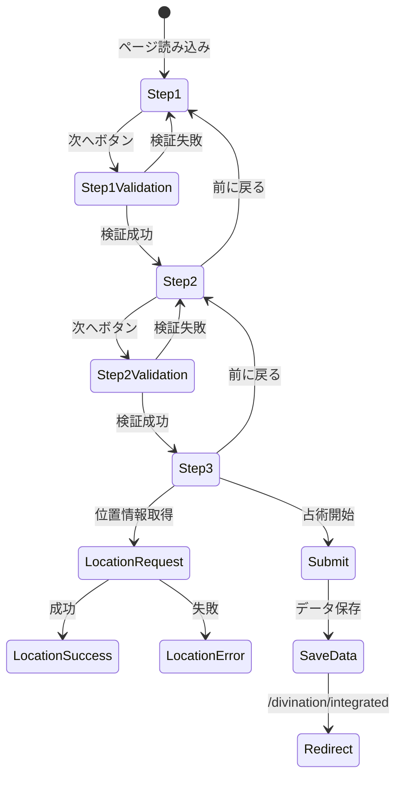

# 入力画面要素マップ (/input)

## 画面概要
- **目的**: ユーザー情報と相談内容の収集
- **パス**: `/input`
- **コンポーネント**: `src/app/input/page.tsx`
- **ステップ数**: 3

## プログレスバー構造

```
+----------------------------------+
|        input-nav-progress        |
| [ 1 ]----[ 2 ]----[ 3 ]         |
|  基本情報  相談内容  環境設定   |
+----------------------------------+
```

## 要素マップ

### 共通要素
```typescript
interface InputPageCommonElements {
  'input-header-main': {
    type: 'header';
    position: 'fixed-top';
    children: ['input-button-back', 'input-button-reset', 'input-title'];
  };
  
  'input-nav-progress': {
    type: 'nav';
    role: 'progressbar';
    ariaValueMin: 1;
    ariaValueMax: 3;
    ariaValueNow: number; // 現在のステップ
    children: [
      'input-step-1-indicator',
      'input-step-2-indicator', 
      'input-step-3-indicator'
    ];
  };
  
  'input-button-back': {
    type: 'link';
    text: '← ダッシュボードに戻る';
    destination: '/';
  };
  
  'input-button-reset': {
    type: 'button';
    text: '🔄 入力をリセット';
    action: 'clearLocalStorage';
  };
}
```

### ステップ1: 基本情報
```typescript
interface Step1Elements {
  'input-section-basic': {
    type: 'section';
    title: '基本情報をお聞かせください';
    visibility: { step: 1 };
  };
  
  'input-input-fullname': {
    type: 'input';
    inputType: 'text';
    label: 'お名前（フルネーム）*';
    placeholder: '山田太郎';
    required: true;
    validation: {
      minLength: 2,
      maxLength: 50
    };
  };
  
  'input-select-birth-year': {
    type: 'select';
    label: '生年';
    options: generateYearOptions(100); // 過去100年
    required: true;
  };
  
  'input-select-birth-month': {
    type: 'select';
    label: '生月';
    options: generateMonthOptions();
    required: true;
  };
  
  'input-select-birth-day': {
    type: 'select';
    label: '生日';
    options: generateDayOptions();
    required: true;
  };
  
  'input-input-birthtime': {
    type: 'input';
    inputType: 'time';
    label: '生誕時刻';
    optional: true;
    helpText: '正確な時刻がわからない場合は空欄でも結構です';
  };
  
  'input-input-birthplace': {
    type: 'input';
    inputType: 'text';
    label: '出生地*';
    placeholder: '東京都渋谷区';
    required: true;
    autocomplete: 'address-level2';
  };
  
  'input-button-step1-next': {
    type: 'button';
    text: '次へ進む';
    action: 'validateStep1AndProceed';
    disabled: !isStepComplete(1);
  };
}
```

### ステップ2: 相談内容
```typescript
interface Step2Elements {
  'input-section-question': {
    type: 'section';
    title: 'ご相談内容をお聞かせください';
    visibility: { step: 2 };
  };
  
  'input-select-category': {
    type: 'button-group';
    label: '相談カテゴリ*';
    required: true;
    options: [
      { value: '総合運', label: '総合運' },
      { value: '恋愛・結婚', label: '恋愛・結婚' },
      { value: '仕事・転職', label: '仕事・転職' },
      { value: '人間関係', label: '人間関係' },
      { value: '健康', label: '健康' },
      { value: '金運・財運', label: '金運・財運' },
      { value: '学業', label: '学業' },
      { value: '家族', label: '家族' },
      { value: '引越し・移住', label: '引越し・移住' },
      { value: 'その他', label: 'その他' }
    ];
    layout: 'grid';
    gridCols: { mobile: 2, tablet: 3, desktop: 3 };
  };
  
  'input-input-question': {
    type: 'textarea';
    label: '具体的なご相談内容*';
    placeholder: 'どのようなことでお悩みでしょうか？詳しくお聞かせください。';
    required: true;
    rows: 5;
    maxLength: 500;
    showCharCount: true;
  };
  
  'input-button-step2-prev': {
    type: 'button';
    text: '前に戻る';
    action: 'goToStep1';
    variant: 'secondary';
  };
  
  'input-button-step2-next': {
    type: 'button';
    text: '次へ進む';
    action: 'validateStep2AndProceed';
    disabled: !isStepComplete(2);
  };
}
```

### ステップ3: 環境設定
```typescript
interface Step3Elements {
  'input-section-location': {
    type: 'section';
    title: '環境データ設定';
    visibility: { step: 3 };
    description: 'より正確な占術結果のため、現在地の環境データ（月相・天候・天体情報）の使用を選択できます。';
  };
  
  'input-checkbox-use-location': {
    type: 'checkbox';
    label: '現在地の環境データを使用する（任意）';
    checked: false;
    onChange: 'toggleLocationSection';
  };
  
  'input-button-location': {
    type: 'button';
    text: '📍 現在地を取得する';
    action: 'requestGeolocation';
    visibility: { condition: 'useLocation && !hasLocation' };
    variant: 'success';
  };
  
  'input-display-location': {
    type: 'info-box';
    visibility: { condition: 'hasLocation' };
    variant: 'success';
    content: {
      title: '✅ 位置情報が取得されました',
      latitude: number;
      longitude: number;
    };
  };
  
  'input-error-location': {
    type: 'info-box';
    visibility: { condition: 'locationError' };
    variant: 'warning';
    content: {
      title: '位置情報の取得に失敗しました',
      message: '一般的な環境データで占術を実行いたします。'
    };
  };
  
  'input-info-no-location': {
    type: 'info-box';
    visibility: { condition: '!useLocation' };
    variant: 'info';
    content: {
      message: '位置情報を使用しない場合、標準的な環境設定で占術を実行します。'
    };
  };
  
  'input-button-step3-prev': {
    type: 'button';
    text: '前に戻る';
    action: 'goToStep2';
    variant: 'secondary';
  };
  
  'input-button-submit': {
    type: 'button';
    text: '✨ 占術を開始する';
    action: 'submitAndRedirect';
    destination: '/divination/integrated';
    variant: 'primary';
    loading: isLoading;
    loadingText: '宇宙と対話中...';
  };
}
```

## バリデーションルール

### ステップ1
- 名前: 必須、2文字以上50文字以下
- 生年月日: すべて必須
- 出生地: 必須
- 生誕時刻: 任意

### ステップ2
- カテゴリ: 必須選択
- 相談内容: 必須、500文字以内

### ステップ3
- すべて任意項目

## インタラクションフロー



## レスポンシブ対応

### モバイル (< 768px)
- カテゴリボタン: 2列
- フォーム幅: 90%
- プログレスバー: コンパクト表示

### タブレット (768px - 1023px)
- カテゴリボタン: 3列
- フォーム幅: max-w-2xl

### デスクトップ (≥ 1024px)
- カテゴリボタン: 3列
- フォーム幅: max-w-4xl
- サイドナビゲーション表示

## データ保存

### localStorage構造
```typescript
interface SavedUserData {
  fullName: string;
  birthDate: string;
  birthTime?: string;
  birthPlace: string;
  currentLocation?: {
    latitude: number;
    longitude: number;
  };
  question: string;
  questionCategory: string;
  savedAt: string; // ISO timestamp
}
```

### 保存タイミング
- 各ステップ完了時に自動保存
- ページ離脱時に保存
- 明示的なリセットまで保持

## アクセシビリティ

### ARIA属性
- プログレスバー: `role="progressbar"`
- 必須フィールド: `aria-required="true"`
- エラーメッセージ: `aria-live="polite"`

### フォーカス管理
- ステップ変更時に最初の入力フィールドにフォーカス
- Tab順序の適切な設定
- エラー発生時に該当フィールドにフォーカス