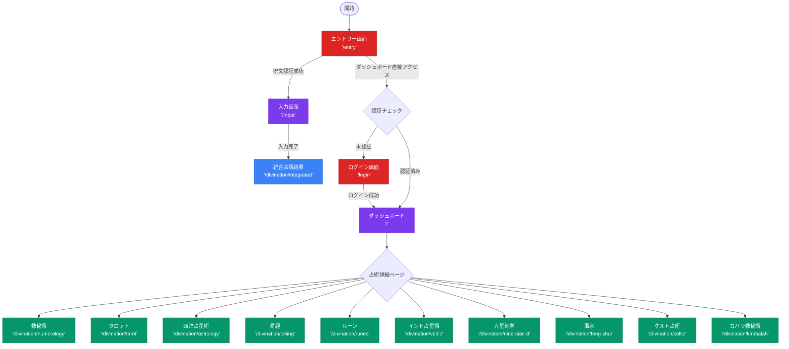

# COSMIC ORACLE 画面フロー図

## 概要
COSMIC ORACLEの全画面遷移と各画面の要素マッピングを定義します。

## 画面フロー図



## 画面別要素ID体系

### ID命名規則
- 形式: `[画面プレフィックス]-[要素タイプ]-[機能名]`
- 例: `entry-input-password`, `dashboard-button-numerology`

### 画面プレフィックス一覧
| 画面 | プレフィックス | パス |
|------|----------------|------|
| エントリー | entry | /entry |
| 入力 | input | /input |
| ログイン | login | /login |
| ダッシュボード | dashboard | / |
| 統合占術 | integrated | /divination/integrated |
| 数秘術 | numerology | /divination/numerology |
| タロット | tarot | /divination/tarot |
| 西洋占星術 | astrology | /divination/astrology |
| 易経 | iching | /divination/iching |
| ルーン | runes | /divination/runes |
| インド占星術 | vedic | /divination/vedic |
| 九星気学 | nine-star | /divination/nine-star-ki |
| 風水 | feng-shui | /divination/feng-shui |
| ケルト占術 | celtic | /divination/celtic |
| カバラ数秘術 | kabbalah | /divination/kabbalah |

### 要素タイプ一覧
| タイプ | 説明 | 例 |
|--------|------|----|
| button | ボタン | button-submit |
| input | 入力フィールド | input-password |
| select | 選択フィールド | select-category |
| card | カード要素 | card-overview |
| nav | ナビゲーション | nav-main |
| header | ヘッダー | header-title |
| section | セクション | section-results |
| modal | モーダル | modal-confirm |
| toast | トースト通知 | toast-success |

## 主要画面の要素マップ

### 1. エントリー画面 (/entry)
| 要素ID | 要素タイプ | 説明 | 座標/位置 |
|--------|------------|------|----------|
| entry-header-title | h1 | COSMIC ORACLE | 中央上部 |
| entry-input-password | input[password] | 呪文入力欄 | 中央 |
| entry-button-enter | button | 扉を開くボタン | 中央下部 |
| entry-text-subtitle | p | サブタイトル | タイトル下 |

### 2. 入力画面 (/input)
| 要素ID | 要素タイプ | 説明 | ステップ |
|--------|------------|------|----------|
| input-nav-progress | div | プログレスバー | 上部固定 |
| input-section-basic | section | 基本情報入力 | Step 1 |
| input-input-fullname | input[text] | 名前入力 | Step 1 |
| input-select-birth-year | select | 生年選択 | Step 1 |
| input-select-birth-month | select | 生月選択 | Step 1 |
| input-select-birth-day | select | 生日選択 | Step 1 |
| input-input-birthtime | input[time] | 生誕時刻 | Step 1 |
| input-input-birthplace | input[text] | 出生地 | Step 1 |
| input-section-question | section | 相談内容入力 | Step 2 |
| input-select-category | div | カテゴリ選択 | Step 2 |
| input-input-question | textarea | 相談内容 | Step 2 |
| input-section-location | section | 位置情報設定 | Step 3 |
| input-button-location | button | 位置情報取得 | Step 3 |
| input-button-submit | button | 占術開始 | Step 3 |

### 3. ダッシュボード (/)
| 要素ID | 要素タイプ | 説明 | 位置 |
|--------|------------|------|------|
| dashboard-header-main | header | メインヘッダー | 上部固定 |
| dashboard-nav-user | nav | ユーザーメニュー | 右上 |
| dashboard-card-cosmic | div | 宇宙図概要 | 左上大 |
| dashboard-card-environment | div | 環境データ | 右上 |
| dashboard-card-guidance | div | 今日の指針 | 右中 |
| dashboard-section-divinations | section | 占術一覧 | 下部 |
| dashboard-card-numerology | div | 数秘術カード | 占術グリッド |
| dashboard-card-tarot | div | タロットカード | 占術グリッド |
| dashboard-card-astrology | div | 占星術カード | 占術グリッド |
| dashboard-button-integrated | button | 統合占術ボタン | 下部中央 |

### 4. 占術詳細ページ (共通テンプレート)
| 要素ID | 要素タイプ | 説明 | 位置 |
|--------|------------|------|------|
| [prefix]-header-title | h1 | 占術名 | 上部 |
| [prefix]-section-infographic | section | インフォグラフィック | 中央上 |
| [prefix]-section-interpretation | section | 解釈・説明 | 中央 |
| [prefix]-section-environment | section | 環境影響 | 右サイド |
| [prefix]-button-refresh | button | 再計算 | 下部 |
| [prefix]-button-share | button | 共有 | 下部 |

## インタラクションマップ

### クリック可能要素の定義
```typescript
interface ClickableElement {
  id: string;              // 要素ID
  type: 'button' | 'link' | 'card' | 'input';
  action: string;          // 実行されるアクション
  destination?: string;    // 遷移先（該当する場合）
  validation?: string[];   // 必要な検証
}
```

### 主要インタラクション
1. **認証フロー**
   - entry-button-enter → 呪文検証 → /input
   - login-button-submit → 認証 → /

2. **入力フロー**
   - input-button-submit → データ保存 → /divination/integrated
   - 各ステップのnext/prev → ステップ遷移

3. **ダッシュボードナビゲーション**
   - dashboard-card-[占術名] → /divination/[占術名]
   - dashboard-button-integrated → /divination/integrated

4. **占術詳細操作**
   - [prefix]-button-refresh → 再計算実行
   - [prefix]-button-share → 共有モーダル表示

## アクセシビリティ考慮

### ARIA属性
- すべてのインタラクティブ要素に`aria-label`
- フォーカス管理のための`tabindex`
- 状態変化の`aria-live`領域

### キーボードナビゲーション
- Tab順序の明確化
- Escapeキーでモーダル閉じる
- Enterキーでフォーム送信

## レスポンシブブレークポイント

| デバイス | ブレークポイント | 特徴 |
|----------|-----------------|------|
| モバイル | < 768px | 縦積みレイアウト |
| タブレット | 768px - 1023px | 2カラムグリッド |
| デスクトップ | ≥ 1024px | 3カラムグリッド |

## 次のステップ

1. 各画面の詳細要素マップ作成（element-maps/）
2. インタラクティブHTMLマップ実装（ui-reference.html）
3. UI要素マッピングユーティリティ開発（ui-mapper.ts）